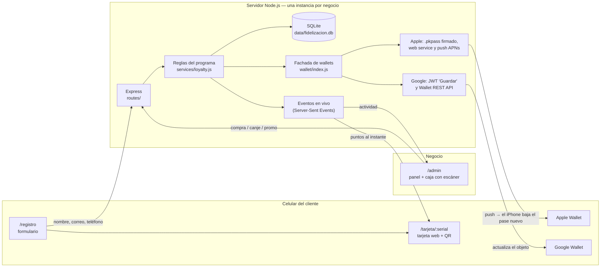

# Fidelización con Wallet: demo y base para pilotos

Demo del servicio de [Fidelización de HoraCeroIA](https://horaceroia.com/servicios/fidelizacion/): la tarjeta de cliente frecuente,
pero dentro del celular. Funciona con **puntos o sellos** en **Apple Wallet**, **Google Wallet** o **tarjeta web**.
El flujo completo:

1. El cliente escanea un **QR en caja** (o toca un enlace que le mandan por **WhatsApp**) y llena nombre, correo y teléfono. No instala ninguna app ni crea una cuenta.
2. Recibe su **tarjeta digital**, que puede guardar en Apple Wallet o Google Wallet. Si no hay wallets configuradas, usa la tarjeta web instalable.
3. En cada compra, el cajero **escanea el QR de la tarjeta** desde el panel y digita el monto.
4. Los **puntos o sellos se suman solos**. La tarjeta del cliente se actualiza en vivo y el panel registra la venta.
5. Al llegar a cierto puntaje, el cliente **canjea un producto gratis**.
6. El negocio envía **campañas** que le llegan al cliente como aviso en el teléfono. Con el plan Plata, además, a un segmento: nuevos, frecuentes, inactivos o VIP.

El preset inicial es **Fusion Truck (Alajuela, Costa Rica)**, pero todo es configurable desde el panel: plan, marca, colores, logo, foto de portada, tipo de tarjeta, reglas, niveles, premios, moneda y país. Así se reutiliza con cualquier negocio.

## Planes (como en horaceroia.com)

El plan se elige en **Ajustes → Plan contratado**. En el demo se puede cambiar en vivo para mostrar qué agrega cada uno.

| Función | Base | Plata |
|---|:-:|:-:|
| Tarjeta con tu marca en Apple Wallet y Google Wallet (o tarjeta web) | ✅ | ✅ |
| Código QR único por cliente y formulario de registro | ✅ | ✅ |
| Puntos o sellos, y premios que se canjean en el mostrador | ✅ | ✅ |
| Panel con clientes, tarjetas emitidas y premios canjeados | ✅ | ✅ |
| Acceso para cajeros (escanean, suman y canjean) | ✅ | ✅ |
| Base de clientes con historial y exportación CSV | ✅ | ✅ |
| Campañas a todos los clientes | ✅ | ✅ |
| **Niveles** (ej. Clásico, Oro +10 %, VIP +20 % de puntos por compra) | — | ✅ |
| **Segmentación**: nuevos, frecuentes, inactivos y VIP | — | ✅ |
| **Campañas por segmento** (aviso en el teléfono) | — | ✅ |
| **Panel avanzado**: segmentos, cada cuánto vuelven y clientes por nivel | — | ✅ |

La matriz está en `src/settings.js` (`PLANS`). Si cambian los planes comerciales, se ajusta ahí.

---

## Instalarlo en tu computadora (lo más fácil)

1. Instala **Node.js LTS** desde <https://nodejs.org> (siguiente, siguiente, finalizar). Solo la primera vez.
2. Descarga el proyecto:
   - **Sin Git:** [descargar ZIP de la rama](https://github.com/gersonsteven-rgb/beta-todo-cli/archive/refs/heads/claude/festive-galileo-c963h3.zip), descomprímelo y entra a la carpeta `fidelizacion`.
   - **Con Git:** `git clone -b claude/festive-galileo-c963h3 https://github.com/gersonsteven-rgb/beta-todo-cli.git` y entra a `beta-todo-cli/fidelizacion`.
3. Doble clic en **`iniciar-demo.bat`** (Windows) o **`iniciar-demo.command`** (Mac). La primera vez instala todo y crea datos de ejemplo; después abre el panel en el navegador.
4. Entra con `admin@demo.com` / `demo1234`.

En Windows, la primera vez el firewall pregunta si Node.js puede usar la red: acepta en **redes privadas** para que los celulares del mismo Wi-Fi puedan registrarse.
En Mac, si dice que no puede abrir el archivo: clic derecho → Abrir.

### Probar todo en tu computadora

| Qué probar | Dónde |
|---|---|
| Registro de un cliente | Escanea con tu celular el QR que aparece en la terminal o en **QR registro** (celular en el mismo Wi-Fi) |
| Tarjeta en vivo | Deja la tarjeta abierta en el celular y registra una compra en **Caja**: el celular muestra "+N puntos" |
| Escanear con cámara | En **Caja → Activar cámara** (la cámara de la laptop funciona en `localhost`) |
| Premios, niveles, segmentos | **Premios**, **Clientes** (filtros por segmento) y **Panel** |
| Campañas | **Campañas**: envía a un segmento. En el registro marca "Quiero recibir promociones" |
| Plan Base / Plata, puntos / sellos, colores, logo, portada | **Ajustes** |
| Volver a empezar | Cierra la ventana y ejecuta `npm run reset` (o `npm run reset -- --sellos`) |

### Hacer mejoras

- Abre la carpeta `fidelizacion` en VS Code y usa `npm run dev`: el servidor se reinicia solo al guardar.
- Pantallas del cliente: `public/registro.html`, `public/tarjeta.html`, `public/js/`, `public/css/cliente.css`.
- Panel: `public/admin/admin.js` y `public/admin/admin.css` (recarga el navegador para ver los cambios).
- Reglas de negocio: `src/services/loyalty.js` (puntos y canjes), `src/services/segments.js`, `src/settings.js` (planes y valores por defecto).

## Arranque rápido (terminal)

Requisitos: **Node.js 22.13 o superior** (se recomienda Node 24 LTS). No necesita base de datos externa ni compilar nada.

```bash
cd fidelizacion
npm install
npm run reset     # crea la base con 64 clientes y 4 meses de compras de ejemplo (opcional)
npm start
```

- Panel: <http://localhost:3000/admin>, usuario `admin@demo.com` / `demo1234`
- Registro de clientes: <http://localhost:3000/registro>

Al arrancar, la terminal muestra las URLs de la red local y un **QR** para registrarse desde el celular.

| Comando | Qué hace |
|---|---|
| `npm start` | Levanta el servidor |
| `npm run dev` | Igual, pero se reinicia al editar código |
| `npm run seed` | Agrega datos de ejemplo si la base está vacía |
| `npm run reset` | Borra la base y la vuelve a crear con datos de ejemplo (tarjeta de **puntos**) |
| `npm run reset -- --sellos` | Igual, pero con tarjeta de **sellos** (5 sellos = refresco, 10 = papas Fusion) |

Los datos de ejemplo simulan 4 meses de operación: 64 clientes entre fans, frecuentes, ocasionales y perdidos, así que la segmentación y los niveles tienen de todo.

---

## Guion sugerido para el demo con el cliente

1. **Panel** (laptop): mostrá las tarjetas emitidas, las ventas, la actividad en vivo y los **segmentos**. Tocá "Inactivos": "estos 20 clientes no vienen hace un mes".
2. **QR de registro**: abrilo en pantalla o impreso. Que el cliente lo escanee con **su propio celular**, o mandale el enlace con **Compartir por WhatsApp**.
3. Llena sus datos y en 30 segundos tiene su tarjeta con **5 puntos de regalo**. Pedile que marque **"Quiero recibir promociones"**: las campañas solo llegan a quien acepta.
4. **Caja**: activá la cámara de la laptop y escaneá el QR de su celular. Registrá una compra de ₡8 500.
   → En su celular aparece **"+8 puntos"** al instante, sin recargar.
5. Canjeá un premio y mostrá cómo baja el saldo y queda en el historial.
6. Buscá un cliente **VIP** en Clientes y registrale una compra: suma **+20 %** por su nivel.
7. **Campañas**: enviá "¡Te extrañamos!" a **Inactivos** o "Doble puntos el viernes" a **Todos**. Aparece en su tarjeta al momento; con wallets configuradas, llega como aviso.
8. **Ajustes**: cambiá colores, logo o foto de portada en vivo. Pasá de **Plata a Base** para mostrar la diferencia entre planes. Para un café o barbería, mostrá la tarjeta de **sellos** (`npm run reset -- --sellos`).

---

## Probarlo con celulares

Los celulares deben poder llegar a tu computadora. Hay dos opciones:

**A. Misma red Wi-Fi (lo más simple).** El QR de registro usa automáticamente la IP local (`http://192.168.x.x:3000`).
Limitación: el navegador **solo permite usar la cámara en `localhost` o `https`**. Escaneá con la cámara de la laptop, o bien digitá el código o usá un lector USB.

**B. Túnel https (recomendado para demos y obligatorio para wallets).** Con [cloudflared](https://developers.cloudflare.com/cloudflare-one/connections/connect-networks/downloads/), gratis y sin cuenta:

```bash
cloudflared tunnel --url http://localhost:3000
# → https://algo-aleatorio.trycloudflare.com
```

Abrí el panel **con esa URL**, entrá a **QR registro** y tocá **"Usar esta URL para el QR"**. También podés pegarla en Ajustes → URL pública o en `PUBLIC_URL` dentro de `.env`.
Así funciona con datos móviles, la cámara sirve desde cualquier celular o tablet y las wallets pueden descargar el logo y actualizarse.

---

## Arquitectura



**Decisiones clave**

- **Una instancia por negocio.** Cada cliente tuyo tiene su carpeta `data/` (base + logo) y su `.env`. Es simple de operar mientras tenés pocos clientes, y el esquema ya está pensado para migrar a SaaS (ver al final).
- **Libro mayor de puntos.** Cada movimiento (bienvenida, compra, canje, ajuste, anulación) queda en `transactions`. El saldo de `customers` es un acumulado que siempre se puede reconstruir desde ahí.
- **La tarjeta web siempre funciona.** Las wallets son adaptadores que se activan solo si hay credenciales. Sin ellas, el demo funciona igual.
- **Sin dependencias nativas.** Usa SQLite integrado en Node (`node:sqlite`), así que `npm install` funciona igual en Windows, Mac y Linux.
- **Código de tarjeta no adivinable.** El QR lleva un código aleatorio tipo `7F3C-XQT7`, con alfabeto sin 0/O/1/I. La URL de la tarjeta usa un UUID aparte.

### Flujos

| Flujo | Qué pasa |
|---|---|
| Registro | `POST /api/public/register` valida los datos y el consentimiento, crea el cliente con su código, serial y bono de bienvenida, y avisa al panel. Si el correo y el teléfono ya existen, devuelve la misma tarjeta, lo que permite recuperarla desde otro celular. |
| Compra | El cajero escanea (cámara, lector USB o digitado) y se llama a `GET /api/admin/lookup`. Luego `POST /customers/:id/earn` calcula los puntos con la regla, suma la visita y dispara SSE a la tarjeta y al panel, además de la actualización de las wallets. |
| Canje | `POST /customers/:id/redeem` verifica el saldo y resta los puntos del premio. |
| Error de caja | El dueño puede **anular** una compra o canje. Se crea el movimiento inverso y el original queda tachado. |
| Campaña | `POST /promotions` con un segmento (`all`, `new`, `frequent`, `inactive`, `vip`). Se calculan los destinatarios (segmento ∩ aceptaron promociones), se guardan en `promotion_recipients` y la campaña aparece al instante en sus tarjetas web. También se hace push a sus iPhones y se envía un mensaje con aviso a su Google Wallet. `DELETE /promotions/:id` la retira. |
| Nivel | En cada compra se calcula el nivel por lo acumulado en la historia del cliente (`lifetime_points`). El bono del nivel se suma a los puntos, y si sube de nivel se le avisa ("Subiste a nivel Oro"). |
| Actualización Apple | Push vacío por APNs, luego el iPhone consulta `/wallet/apple/v1/devices/...` y descarga el pase nuevo. Si cambiaron los puntos, aparece la notificación "Puntos disponibles: 25". |

### Modelo de datos (`src/db.js`)

| Tabla | Contenido |
|---|---|
| `settings` | Configuración del negocio en JSON: plan, marca, tipo de tarjeta, reglas, niveles, segmentos, moneda, contacto y ubicación |
| `users` | Usuarios del panel (`owner` = dueño, `staff` = cajero), con contraseñas en scrypt |
| `customers` | Cliente y tarjeta: datos, `code` (QR), `serial` (URL y wallets), saldo, visitas, total comprado y consentimiento |
| `rewards` | Catálogo de premios (nombre, puntos, activo) |
| `transactions` | Libro mayor: `welcome`, `earn`, `redeem`, `adjust`, `void` |
| `promotions` | Campañas enviadas (segmento, cantidad de destinatarios, activa o retirada) |
| `promotion_recipients` | A qué clientes les llegó cada campaña (cada tarjeta muestra su última campaña activa) |
| `apple_registrations` | iPhones que instalaron cada pase, con su token de push |

### API

Pública (celular del cliente):

| Método y ruta | Uso |
|---|---|
| `GET /api/public/program` | Marca, regla y premios (para la página de registro) |
| `POST /api/public/register` | Crear tarjeta |
| `GET /api/public/cards/:serial` | Estado de la tarjeta |
| `GET /api/public/cards/:serial/stream` | Actualizaciones en vivo (SSE) |
| `GET /api/public/cards/:serial/qr.svg` | QR de la tarjeta |
| `GET /wallet/apple/:serial.pkpass` | Descargar el pase de Apple Wallet |
| `GET /wallet/google/:serial` | Redirección a "Guardar en Google Wallet" |
| `/wallet/apple/v1/...` | Web service de Apple Wallet (registro de dispositivos y pases actualizados) |

Panel (`/api/admin`, requiere sesión): `login`, `logout`, `me`, `stream`, `stats`, `lookup`, `customers` (listar con `?segment=`, crear, ver, `earn`, `redeem`, `adjust`, borrar), `transactions/:id/void`, `rewards`, `promotions` (campañas), `settings` (y `settings/logo`, `settings/cover`), `registration-qr`, `users` y `export/customers.csv`.

### Segmentos (plan Plata)

Se calculan al vuelo desde el historial. Las reglas se ajustan en Ajustes → Segmentos.

| Segmento | Regla por defecto |
|---|---|
| Nuevos | Se registraron en los últimos 30 días |
| Frecuentes | 3 o más compras en los últimos 30 días |
| Inactivos | Sin compras hace más de 30 días |
| VIP | Están en el nivel más alto |

Un cliente puede estar en varios a la vez (por ejemplo, nuevo y frecuente).

---

## Activar Apple Wallet

Requiere el **Apple Developer Program** (USD 99 al año). Un solo Pass Type ID de tu empresa sirve para todos tus clientes: cada pase muestra el nombre del negocio correspondiente.

1. En [developer.apple.com](https://developer.apple.com/account/resources/identifiers/list/passTypeId), entrá a Identifiers → **Pass Type IDs** y creá uno, por ejemplo `pass.com.tuempresa.fidelizacion`.
2. Generá la llave y la solicitud de certificado:
   ```bash
   mkdir -p certs/apple
   openssl req -new -newkey rsa:2048 -nodes -keyout certs/apple/signerKey.pem -out pass.csr -subj "/CN=Fidelizacion"
   ```
3. En el Pass Type ID, **Create Certificate**, subí `pass.csr` y descargá `pass.cer`. Convertilo:
   ```bash
   openssl x509 -inform der -in pass.cer -out certs/apple/signerCert.pem
   ```
   (Si exportaste un `.p12` desde Llavero: `openssl pkcs12 -legacy -in cert.p12 -clcerts -nokeys -out certs/apple/signerCert.pem` y `openssl pkcs12 -legacy -in cert.p12 -nocerts -nodes -out certs/apple/signerKey.pem`.)
4. Descargá el certificado intermedio **WWDR G4** desde [apple.com/certificateauthority](https://www.apple.com/certificateauthority/) y convertilo:
   ```bash
   openssl x509 -inform der -in AppleWWDRCAG4.cer -out certs/apple/wwdr.pem
   ```
5. En `.env`, definí `APPLE_PASS_TYPE_ID` y `APPLE_TEAM_ID` (el Team ID de 10 caracteres aparece en Membership).
6. Con `PUBLIC_URL` en **https**, los pases se actualizan solos y el iPhone muestra una notificación al sumar puntos o al llegar una promoción. Con http, los pases se instalan pero no se actualizan.

Opcional: en Ajustes → Ubicación, poné las coordenadas del local. El iPhone mostrará la tarjeta en la pantalla bloqueada cuando el cliente esté cerca.

## Activar Google Wallet

Es gratis.

1. En [Google Pay & Wallet Console](https://pay.google.com/business/console) creá la cuenta de emisor y anotá el **Issuer ID**.
2. En [Google Cloud](https://console.cloud.google.com/), creá un proyecto, habilitá **Google Wallet API**, creá una **cuenta de servicio** y descargá su llave JSON en `certs/google/service-account.json`.
3. En Pay & Wallet Console → **Usuarios**, invitá el correo de la cuenta de servicio con rol de desarrollador.
4. En `.env`, definí `GOOGLE_WALLET_ISSUER_ID` y, opcionalmente, `GOOGLE_WALLET_CLASS_SUFFIX` (uno distinto por negocio).
5. `PUBLIC_URL` debe ser **https**, porque Google descarga el logo desde ahí. Otra opción es `GOOGLE_WALLET_LOGO_URL`.
6. Mientras la cuenta esté en **modo demo**, solo las cuentas de prueba que agregues en la consola pueden guardar pases. Para clientes reales hay que solicitar el acceso de publicación en la consola.

El estado de cada integración, con lo que falta, se ve en el panel → **Ajustes → Wallets**.

---

## Adaptarlo a otro negocio

- **Desde el panel (Ajustes):** plan, nombre, programa, eslogan, colores, logo, **foto de portada**, tipo de tarjeta (**puntos** por monto o por visita, o **sellos** con compra mínima opcional), regalo de bienvenida, niveles, reglas de segmentos, moneda, prefijo telefónico, contacto, ubicación y términos.
- **Foto de portada:** el panel la recorta sola a 1125×369. Sale en la tarjeta web, como franja del pase de Apple Wallet y como imagen principal en Google Wallet.
- **Premios:** panel → Premios.
- **Valores por defecto de una instalación nueva:** `src/settings.js` (`DEFAULT_SETTINGS`) y `src/bootstrap.js` (`DEFAULT_REWARDS`).
- **Varios clientes en la misma máquina:** una carpeta, un `.env`, un `PORT` y un `DATA_DIR` por negocio (por ejemplo `DATA_DIR=data-fusiontruck`, `PORT=3001`).

## Checklist para un piloto real

- [ ] Servidor con disco persistente: un VPS de USD 5–6 al mes alcanza para varios negocios. Node 24 y `npm ci`.
- [ ] Subdominio por negocio con **https** (por ejemplo con [Caddy](https://caddyserver.com/), que saca el certificado solo):
  ```
  fusiontruck.tudominio.com {
    reverse_proxy localhost:3001
  }
  ```
- [ ] `.env` con `PUBLIC_URL=https://fusiontruck.tudominio.com`, una `ADMIN_PASSWORD` fuerte y un `SESSION_SECRET` largo.
- [ ] Proceso siempre activo: `pm2 start "npm start" --name fusiontruck` o un servicio systemd.
- [ ] **Respaldo diario** de la base: `sqlite3 data/fidelizacion.db ".backup respaldo-$(date +%F).db"`.
- [ ] Certificados de Apple y llave de Google en `certs/`, que nunca se suben al repositorio (está en `.gitignore`).
- [ ] Revisar que los datos del negocio (dirección, horario, redes, logo oficial, premios y puntos) coincidan con los reales.
- [ ] Crear usuarios **cajero** para el personal (Ajustes → Usuarios del panel).
- [ ] Imprimir el póster (panel → QR registro → Imprimir) y capacitar al personal (5 minutos: escanear, digitar el monto, canjear).
- [ ] Revisar los términos con el negocio y ajustarlos si hace falta (Ley 8968 de protección de datos de Costa Rica).

## Privacidad y seguridad

- Consentimiento explícito al registrarse, con fecha guardada. Las promociones son opcionales (opt-in).
- El dueño puede **eliminar** a un cliente y su historial (derecho de supresión) y **exportar** la base en CSV.
- Las **campañas solo llegan a quienes aceptaron recibir promociones** al registrarse. La casilla no viene marcada por defecto.
- Contraseñas con scrypt; sesión en cookie firmada, `HttpOnly` y `SameSite=Lax`; límite de intentos en el login y en el registro.
- Roles: el **cajero** solo registra compras, canjes y clientes. El **dueño** además ajusta puntos, anula movimientos, edita premios y ajustes, y envía promociones.
- El web service de Apple valida el `authenticationToken` único de cada pase.

## Camino a SaaS (cuando haya ~5 clientes)

Lo que cambiaría:

1. **Multi-negocio:** una columna `business_id` en todas las tablas, con la configuración por negocio en su propia fila, en vez de una instancia por cliente.
2. **PostgreSQL** en lugar de SQLite. El esquema y el libro mayor se trasladan tal cual.
3. **Eventos en vivo** con Redis pub/sub, para correr varias instancias del servidor.
4. Alta de negocios con suscripción y facturación, y dominio propio por negocio.
5. Un Pass Type ID de Apple y un Issuer de Google compartidos (ya funcionan así), con una clase de Google por negocio (`GOOGLE_WALLET_CLASS_SUFFIX`).

## Estructura

```
fidelizacion/
├── src/
│   ├── server.js            # arranque, rutas, errores y banner con QR
│   ├── config.js            # variables de entorno
│   ├── db.js                # esquema SQLite
│   ├── settings.js          # configuración del negocio, planes, puntos/sellos y niveles
│   ├── bootstrap.js         # usuario dueño y premios iniciales
│   ├── lib/                 # auth (sesión), códigos, eventos SSE
│   ├── services/
│   │   ├── loyalty.js       # registrar, sumar, canjear, ajustar, anular (con bono por nivel)
│   │   ├── cards.js         # estado de la tarjeta compartido por web y wallets
│   │   ├── segments.js      # nuevos, frecuentes, inactivos, VIP
│   │   └── campaigns.js     # campañas por segmento
│   ├── wallet/              # apple.js, apns.js, google.js, index.js (fachada)
│   └── routes/              # public.js, admin.js, wallet.js
├── public/
│   ├── registro.html, tarjeta.html, sw.js, css/, js/
│   └── admin/               # panel (HTML + JS sin build)
├── assets/                  # logo por defecto e íconos del pase
├── scripts/seed.js          # datos de ejemplo
├── iniciar-demo.bat         # doble clic en Windows
├── iniciar-demo.command     # doble clic en Mac
└── .env.example
```

## Marca del proveedor

El panel, la tarjeta y el registro muestran de forma discreta "Fidelización digital por HoraCeroIA". Se cambia con `VENDOR_NAME` / `VENDOR_URL` en `.env`; si `VENDOR_NAME` queda vacío, se oculta.

## Limitaciones conocidas del demo

- Los botones "Agregar a Apple Wallet / Google Wallet" son genéricos. En producción conviene usar los **badges oficiales** de Apple y Google, por sus guías de marca.
- Google no avisa cuando el cliente guarda o borra el pase, a menos que se configuren sus callbacks. Por eso el panel marca "Google" cuando el cliente tocó el botón.
- El límite de intentos es en memoria, suficiente para una instancia por negocio.
- El logo y los datos de Fusion Truck son de ejemplo y deben reemplazarse por los oficiales del negocio.
- Google Wallet limita los avisos a unos 3 por tarjeta cada 24 horas. Apple no fija un límite, pero conviene no saturar.
- En la tarjeta de sellos del pase de Apple, los sellos se muestran como texto (●●●○○). Para dibujarlos sobre la foto habría que generar la imagen de franja por cliente.

Apple Wallet y Google Wallet son marcas de Apple Inc. y de Google LLC. HoraCeroIA no está afiliada a ellas ni las representa.
