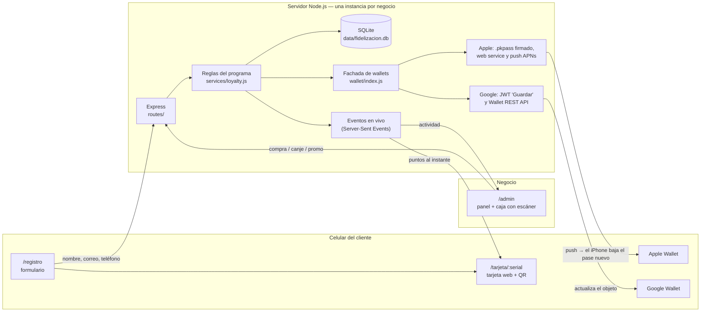

# Fidelización con Wallet: demo y base para pilotos

Programa de lealtad por **puntos** con tarjeta en **Apple Wallet**, **Google Wallet** o **tarjeta web**.
El flujo completo:

1. El cliente escanea un **QR en caja** y llena nombre, correo y teléfono.
2. Recibe su **tarjeta digital**, que puede guardar en Apple Wallet o Google Wallet. Si no hay wallets configuradas, usa la tarjeta web instalable.
3. En cada compra, el cajero **escanea el QR de la tarjeta** desde el panel y digita el monto.
4. Los **puntos se suman solos**. La tarjeta del cliente se actualiza en vivo y el panel registra la venta.
5. Al llegar a cierto puntaje, el cliente **canjea un producto gratis**.

El preset inicial es **Fusion Truck (Alajuela, Costa Rica)**, pero todo es configurable desde el panel: marca, colores, logo, reglas, premios, moneda y país. Así se reutiliza con cualquier negocio.

---

## Arranque rápido

Requisitos: **Node.js 22.13 o superior** (se recomienda Node 24 LTS). No necesita base de datos externa ni compilar nada.

```bash
cd fidelizacion
npm install
npm run reset     # crea la base con ~40 clientes y compras de ejemplo (opcional)
npm start
```

- Panel: <http://localhost:3000/admin>, usuario `admin@demo.com` / `demo1234`
- Registro de clientes: <http://localhost:3000/registro>

Al arrancar, la terminal muestra las URLs de la red local y un **QR** para registrarse desde el celular.

| Comando | Qué hace |
|---|---|
| `npm start` | Levanta el servidor |
| `npm run dev` | Igual, pero se reinicia al editar código |
| `npm run seed` | Agrega datos de ejemplo si la base está vacía |
| `npm run reset` | Borra la base y la vuelve a crear con datos de ejemplo |

---

## Guion sugerido para el demo con el cliente

1. **Panel** (laptop): mostrá los indicadores, la gráfica de ventas y la actividad en vivo con los datos de ejemplo.
2. **QR de registro**: abrilo en pantalla o impreso. Que el cliente lo escanee con **su propio celular**.
3. Llena sus datos y en 30 segundos tiene su tarjeta con **5 puntos de regalo**.
4. **Caja**: activá la cámara de la laptop y escaneá el QR de su celular. Registrá una compra de ₡8 500.
   → En su celular aparece **"+8 pts"** al instante, sin recargar.
5. Canjeá un premio y mostrá cómo baja el saldo y queda en el historial.
6. **Promos**: enviá "¡Doble puntos este viernes!" y aparece en su tarjeta al momento.
   Con wallets configuradas, llega como notificación.
7. **Ajustes**: cambiá colores, logo o nombre en vivo para mostrar que se adapta a cualquier negocio.

---

## Probarlo con celulares

Los celulares deben poder llegar a tu computadora. Hay dos opciones:

**A. Misma red Wi-Fi (lo más simple).** El QR de registro usa automáticamente la IP local (`http://192.168.x.x:3000`).
Limitación: el navegador **solo permite usar la cámara en `localhost` o `https`**. Escaneá con la cámara de la laptop, o bien digitá el código o usá un lector USB.

**B. Túnel https (recomendado para demos y obligatorio para wallets).** Con [cloudflared](https://developers.cloudflare.com/cloudflare-one/connections/connect-networks/downloads/), gratis y sin cuenta:

```bash
cloudflared tunnel --url http://localhost:3000
# → https://algo-aleatorio.trycloudflare.com
```

Abrí el panel **con esa URL**, entrá a **QR registro** y tocá **"Usar esta URL para el QR"**. También podés pegarla en Ajustes → URL pública o en `PUBLIC_URL` dentro de `.env`.
Así funciona con datos móviles, la cámara sirve desde cualquier celular o tablet y las wallets pueden descargar el logo y actualizarse.

---

## Arquitectura



**Decisiones clave**

- **Una instancia por negocio.** Cada cliente tuyo tiene su carpeta `data/` (base + logo) y su `.env`. Es simple de operar mientras tenés pocos clientes, y el esquema ya está pensado para migrar a SaaS (ver al final).
- **Libro mayor de puntos.** Cada movimiento (bienvenida, compra, canje, ajuste, anulación) queda en `transactions`. El saldo de `customers` es un acumulado que siempre se puede reconstruir desde ahí.
- **La tarjeta web siempre funciona.** Las wallets son adaptadores que se activan solo si hay credenciales. Sin ellas, el demo funciona igual.
- **Sin dependencias nativas.** Usa SQLite integrado en Node (`node:sqlite`), así que `npm install` funciona igual en Windows, Mac y Linux.
- **Código de tarjeta no adivinable.** El QR lleva un código aleatorio tipo `7F3C-XQT7`, con alfabeto sin 0/O/1/I. La URL de la tarjeta usa un UUID aparte.

### Flujos

| Flujo | Qué pasa |
|---|---|
| Registro | `POST /api/public/register` valida los datos y el consentimiento, crea el cliente con su código, serial y bono de bienvenida, y avisa al panel. Si el correo y el teléfono ya existen, devuelve la misma tarjeta, lo que permite recuperarla desde otro celular. |
| Compra | El cajero escanea (cámara, lector USB o digitado) y se llama a `GET /api/admin/lookup`. Luego `POST /customers/:id/earn` calcula los puntos con la regla, suma la visita y dispara SSE a la tarjeta y al panel, además de la actualización de las wallets. |
| Canje | `POST /customers/:id/redeem` verifica el saldo y resta los puntos del premio. |
| Error de caja | El dueño puede **anular** una compra o canje. Se crea el movimiento inverso y el original queda tachado. |
| Promoción | `POST /promotions` la guarda como promoción vigente, la muestra en todas las tarjetas web abiertas, hace push a Apple y envía un mensaje con notificación a Google. |
| Actualización Apple | Push vacío por APNs, luego el iPhone consulta `/wallet/apple/v1/devices/...` y descarga el pase nuevo. Si cambiaron los puntos, aparece la notificación "Puntos disponibles: 25". |

### Modelo de datos (`src/db.js`)

| Tabla | Contenido |
|---|---|
| `settings` | Configuración del negocio en JSON: marca, reglas, moneda, contacto, ubicación, promo vigente |
| `users` | Usuarios del panel (`owner` = dueño, `staff` = cajero), con contraseñas en scrypt |
| `customers` | Cliente y tarjeta: datos, `code` (QR), `serial` (URL y wallets), saldo, visitas, total comprado y consentimiento |
| `rewards` | Catálogo de premios (nombre, puntos, activo) |
| `transactions` | Libro mayor: `welcome`, `earn`, `redeem`, `adjust`, `void` |
| `promotions` | Historial de promociones enviadas |
| `apple_registrations` | iPhones que instalaron cada pase, con su token de push |

### API

Pública (celular del cliente):

| Método y ruta | Uso |
|---|---|
| `GET /api/public/program` | Marca, regla y premios (para la página de registro) |
| `POST /api/public/register` | Crear tarjeta |
| `GET /api/public/cards/:serial` | Estado de la tarjeta |
| `GET /api/public/cards/:serial/stream` | Actualizaciones en vivo (SSE) |
| `GET /api/public/cards/:serial/qr.svg` | QR de la tarjeta |
| `GET /wallet/apple/:serial.pkpass` | Descargar el pase de Apple Wallet |
| `GET /wallet/google/:serial` | Redirección a "Guardar en Google Wallet" |
| `/wallet/apple/v1/...` | Web service de Apple Wallet (registro de dispositivos y pases actualizados) |

Panel (`/api/admin`, requiere sesión): `login`, `logout`, `me`, `stream`, `stats`, `lookup`, `customers` (listar, crear, ver, `earn`, `redeem`, `adjust`, borrar), `transactions/:id/void`, `rewards`, `promotions`, `settings` (y `settings/logo`), `registration-qr`, `users` y `export/customers.csv`.

---

## Activar Apple Wallet

Requiere el **Apple Developer Program** (USD 99 al año). Un solo Pass Type ID de tu empresa sirve para todos tus clientes: cada pase muestra el nombre del negocio correspondiente.

1. En [developer.apple.com](https://developer.apple.com/account/resources/identifiers/list/passTypeId), entrá a Identifiers → **Pass Type IDs** y creá uno, por ejemplo `pass.com.tuempresa.fidelizacion`.
2. Generá la llave y la solicitud de certificado:
   ```bash
   mkdir -p certs/apple
   openssl req -new -newkey rsa:2048 -nodes -keyout certs/apple/signerKey.pem -out pass.csr -subj "/CN=Fidelizacion"
   ```
3. En el Pass Type ID, **Create Certificate**, subí `pass.csr` y descargá `pass.cer`. Convertilo:
   ```bash
   openssl x509 -inform der -in pass.cer -out certs/apple/signerCert.pem
   ```
   (Si exportaste un `.p12` desde Llavero: `openssl pkcs12 -legacy -in cert.p12 -clcerts -nokeys -out certs/apple/signerCert.pem` y `openssl pkcs12 -legacy -in cert.p12 -nocerts -nodes -out certs/apple/signerKey.pem`.)
4. Descargá el certificado intermedio **WWDR G4** desde [apple.com/certificateauthority](https://www.apple.com/certificateauthority/) y convertilo:
   ```bash
   openssl x509 -inform der -in AppleWWDRCAG4.cer -out certs/apple/wwdr.pem
   ```
5. En `.env`, definí `APPLE_PASS_TYPE_ID` y `APPLE_TEAM_ID` (el Team ID de 10 caracteres aparece en Membership).
6. Con `PUBLIC_URL` en **https**, los pases se actualizan solos y el iPhone muestra una notificación al sumar puntos o al llegar una promoción. Con http, los pases se instalan pero no se actualizan.

Opcional: en Ajustes → Ubicación, poné las coordenadas del local. El iPhone mostrará la tarjeta en la pantalla bloqueada cuando el cliente esté cerca.

## Activar Google Wallet

Es gratis.

1. En [Google Pay & Wallet Console](https://pay.google.com/business/console) creá la cuenta de emisor y anotá el **Issuer ID**.
2. En [Google Cloud](https://console.cloud.google.com/), creá un proyecto, habilitá **Google Wallet API**, creá una **cuenta de servicio** y descargá su llave JSON en `certs/google/service-account.json`.
3. En Pay & Wallet Console → **Usuarios**, invitá el correo de la cuenta de servicio con rol de desarrollador.
4. En `.env`, definí `GOOGLE_WALLET_ISSUER_ID` y, opcionalmente, `GOOGLE_WALLET_CLASS_SUFFIX` (uno distinto por negocio).
5. `PUBLIC_URL` debe ser **https**, porque Google descarga el logo desde ahí. Otra opción es `GOOGLE_WALLET_LOGO_URL`.
6. Mientras la cuenta esté en **modo demo**, solo las cuentas de prueba que agregues en la consola pueden guardar pases. Para clientes reales hay que solicitar el acceso de publicación en la consola.

El estado de cada integración, con lo que falta, se ve en el panel → **Ajustes → Wallets**.

---

## Adaptarlo a otro negocio

- **Desde el panel (Ajustes):** nombre, programa, eslogan, colores, logo, regla de puntos (por monto o por visita tipo sellos), bono de bienvenida, moneda, prefijo telefónico, contacto, ubicación y términos.
- **Premios:** panel → Premios.
- **Valores por defecto de una instalación nueva:** `src/settings.js` (`DEFAULT_SETTINGS`) y `src/bootstrap.js` (`DEFAULT_REWARDS`).
- **Varios clientes en la misma máquina:** una carpeta, un `.env`, un `PORT` y un `DATA_DIR` por negocio (por ejemplo `DATA_DIR=data-fusiontruck`, `PORT=3001`).

## Checklist para un piloto real

- [ ] Servidor con disco persistente: un VPS de USD 5–6 al mes alcanza para varios negocios. Node 24 y `npm ci`.
- [ ] Subdominio por negocio con **https** (por ejemplo con [Caddy](https://caddyserver.com/), que saca el certificado solo):
  ```
  fusiontruck.tudominio.com {
    reverse_proxy localhost:3001
  }
  ```
- [ ] `.env` con `PUBLIC_URL=https://fusiontruck.tudominio.com`, una `ADMIN_PASSWORD` fuerte y un `SESSION_SECRET` largo.
- [ ] Proceso siempre activo: `pm2 start "npm start" --name fusiontruck` o un servicio systemd.
- [ ] **Respaldo diario** de la base: `sqlite3 data/fidelizacion.db ".backup respaldo-$(date +%F).db"`.
- [ ] Certificados de Apple y llave de Google en `certs/`, que nunca se suben al repositorio (está en `.gitignore`).
- [ ] Revisar que los datos del negocio (dirección, horario, redes, logo oficial, premios y puntos) coincidan con los reales.
- [ ] Crear usuarios **cajero** para el personal (Ajustes → Usuarios del panel).
- [ ] Imprimir el póster (panel → QR registro → Imprimir) y capacitar al personal (5 minutos: escanear, digitar el monto, canjear).
- [ ] Revisar los términos con el negocio y ajustarlos si hace falta (Ley 8968 de protección de datos de Costa Rica).

## Privacidad y seguridad

- Consentimiento explícito al registrarse, con fecha guardada. Las promociones son opcionales (opt-in).
- El dueño puede **eliminar** a un cliente y su historial (derecho de supresión) y **exportar** la base en CSV.
- Contraseñas con scrypt; sesión en cookie firmada, `HttpOnly` y `SameSite=Lax`; límite de intentos en el login y en el registro.
- Roles: el **cajero** solo registra compras, canjes y clientes. El **dueño** además ajusta puntos, anula movimientos, edita premios y ajustes, y envía promociones.
- El web service de Apple valida el `authenticationToken` único de cada pase.

## Camino a SaaS (cuando haya ~5 clientes)

Lo que cambiaría:

1. **Multi-negocio:** una columna `business_id` en todas las tablas, con la configuración por negocio en su propia fila, en vez de una instancia por cliente.
2. **PostgreSQL** en lugar de SQLite. El esquema y el libro mayor se trasladan tal cual.
3. **Eventos en vivo** con Redis pub/sub, para correr varias instancias del servidor.
4. Alta de negocios con suscripción y facturación, y dominio propio por negocio.
5. Un Pass Type ID de Apple y un Issuer de Google compartidos (ya funcionan así), con una clase de Google por negocio (`GOOGLE_WALLET_CLASS_SUFFIX`).

## Estructura

```
fidelizacion/
├── src/
│   ├── server.js            # arranque, rutas, errores y banner con QR
│   ├── config.js            # variables de entorno
│   ├── db.js                # esquema SQLite
│   ├── settings.js          # configuración del negocio y reglas de puntos
│   ├── bootstrap.js         # usuario dueño y premios iniciales
│   ├── lib/                 # auth (sesión), códigos, eventos SSE
│   ├── services/
│   │   ├── loyalty.js       # registrar, sumar, canjear, ajustar, anular
│   │   └── cards.js         # estado de la tarjeta compartido por web y wallets
│   ├── wallet/              # apple.js, apns.js, google.js, index.js (fachada)
│   └── routes/              # public.js, admin.js, wallet.js
├── public/
│   ├── registro.html, tarjeta.html, sw.js, css/, js/
│   └── admin/               # panel (HTML + JS sin build)
├── assets/                  # logo por defecto e íconos del pase
├── scripts/seed.js          # datos de ejemplo
└── .env.example
```

## Limitaciones conocidas del demo

- Los botones "Agregar a Apple Wallet / Google Wallet" son genéricos. En producción conviene usar los **badges oficiales** de Apple y Google, por sus guías de marca.
- Google no avisa cuando el cliente guarda o borra el pase, a menos que se configuren sus callbacks. Por eso el panel marca "Google" cuando el cliente tocó el botón.
- El límite de intentos es en memoria, suficiente para una instancia por negocio.
- El logo y los datos de Fusion Truck son de ejemplo y deben reemplazarse por los oficiales del negocio.
